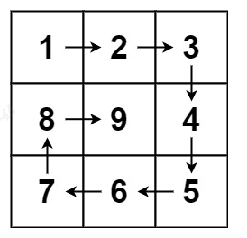
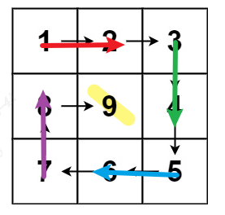

# Spiral Matrix2

medium

https://leetcode.com/problems/spiral-matrix-ii/



## Solution

### 1. rules for turning
At first, I do not have a better solution than describing the process directly. It gives the rules of each turning. 

So I am doing like this:


```python
def generateMatrix(n: int) -> List[List[int]]:
    res = [[0]*n for _ in range(n)]

    count = 1
    direction = 0
    i = 0
    j = 0
    range_col = [0, n-1]
    range_row = [0, n-1]

    while count <= n**2:
        res[i][j] = count
        # right
        if direction == 0:
            if j == range_col[1]:
                i += 1
                range_row[0] += 1
                direction = 1
            else:
                j += 1
        # down
        elif direction == 1:
            if i == range_row[1]:
                j -= 1
                range_col[1] -= 1
                direction = 2
            else:
                i += 1
        # left
        elif direction == 2:
            if j == range_col[0]:
                i -= 1
                range_row[1] -= 1
                direction = 3
            else:
                j -= 1
        # up
        else:
            if i == range_row[0]:
                j += 1
                range_col[0] += 1
                direction = 0
            else:
                i -= 1
        count += 1
```

### 2. circling

This is an interesting thought. It describes the process like this:



Only considering how to walk around the outer circle and then move inside 1 bit. 

The defination of the range should be considered: [) or (]

Usually I like to use [)

If n is odd, you still need to fill the center point.

```python
def generateMatrix(n: int) -> List[List[int]]:
    res = [[0]*n for _ in range(n)]

    count = 1
    startx = 0
    starty = 0
    loop = n // 2

    for offset in range(1, loop+1):
        for j in range(starty, n-offset):
            res[startx][j] = count
            count += 1
        for i in range(startx, n-offset):
            res[i][n-offset] = count
            count += 1
        for j in range(n-offset, starty, -1):
            res[n-offset][j] = count
            count += 1
        for i in range(n-offset, startx, -1):
            res[i][starty] = count
            count += 1
        
        startx += 1
        starty += 1
    
    if n%2 == 1:
        mid = n//2
        res[mid][mid] = count
    
    return res
```

## Summary

This problem is about how to design good rules and implement what you have designed correctly. No algorithm is needed.