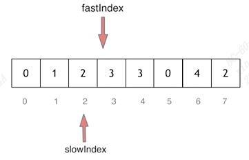

# RemoveElement

easy

https://leetcode.com/problems/remove-element/


It is a little different from simply removing elements because you need to move forward the rest of the element to where the elements have been removed. Return the size of rest array.

example:

list = \[1,2,3,4,3,3\] remove = 3

result = 3, list = \[1,2,4,\_,\_,\_\] ('\_' means the elements here are not necessary)

## solution

double pointer

## 1.same direction

Fast pointer get the non-'val' element. Slow pointer is the position of output list.

Actually, put the non-val element to the final output position



```python
def removeElement(nums, val):
    slow = 0
    n = len(nums)
    count = 0
    for fast in range(n):
        if nums[fast] != val:
            nums[slow] = nums[fast]
            slow += 1
            count += 1
    return count
```


## 2. opposite direction

Left pointer find 'val' position. Right pointer find non-'val' position. Put the right value to the left position.

The solution seems a little confusing. I do not know why using <= or < in certain place. Seems that 'l' is finally the length of output, so it should reach the position 'r' as end.

```python
def removeElement(nums, val):
    l = 0
    r = len(nums)-1
    while l<=r:
        while l <= r and nums[l] != val:
            l += 1
        while l <= r and nums[r] == val:
            r -= 1
        if l < r:
            nums[l] = nums[r]
            l += 1
            r -= 1
    return l
```
