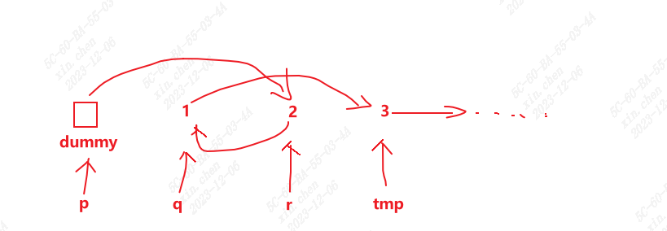

# Swap Nodes in Pairs

https://leetcode.com/problems/swap-nodes-in-pairs/

## Solution

It is a little difficult to implement the thought.

For the two nodes we are trying to swap, we need to get one before and one after them to achieve this. And a dummy head is used.



Then the sequence is: dummy -> 2 -> 1 -> 3. and p should be at q position for the next time (careful about the order and the next position).

```python

# Definition for singly-linked list.
# class ListNode:
#     def __init__(self, val=0, next=None):
#         self.val = val
#         self.next = next
class Solution:
    def swapPairs(self, head: Optional[ListNode]) -> Optional[ListNode]:
        if not head or not head.next:
            return head

        dummy = ListNode(0, head)
        p = dummy
        while p.next and p.next.next:
            q = p.next
            r = q.next
            tmp = r.next
            p.next = r
            r.next = q
            q.next = tmp
            p = q
        return dummy.next
```