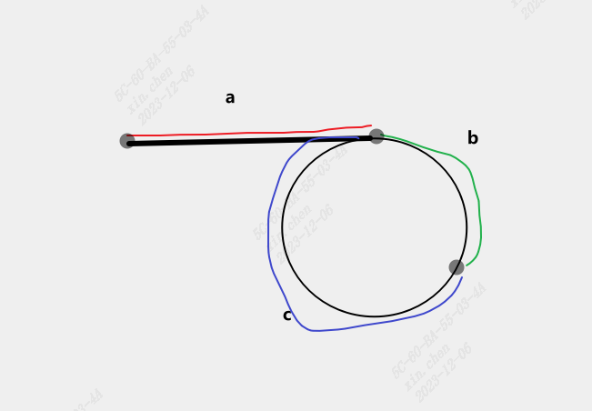

# Linked List Cycle II

https://leetcode.com/problems/linked-list-cycle-ii/

## solution

It needs a deduction.



Using fast and slow pointer. When they meet, the distance the fast pointer has walked is a+n*(b+c)+b, the distance of slow one is a+b. Then we have the equation: 2*(a+b) = a+n*(b+c)+b

We need a as a result. From the equation, we can get a = n(b+c)-b = (n-1)*(b+c)+c. n-1>0 because it takes the fast one at least one round to meet the slow one. Ignoring the complete round which is b+c, the distance can be a = c. This time we let fast go from head with the same speed as slow, the meeting point will be the result we need.

```python
# Definition for singly-linked list.
# class ListNode:
#     def __init__(self, x):
#         self.val = x
#         self.next = None

class Solution:
    def detectCycle(self, head: Optional[ListNode]) -> Optional[ListNode]:
        slow = fast = head
        while fast and fast.next:
            fast = fast.next.next
            slow = slow.next

            if fast == slow:
                fast = head             
                while fast != slow:
                    fast = fast.next
                    slow = slow.next
                return fast
        return None 

```